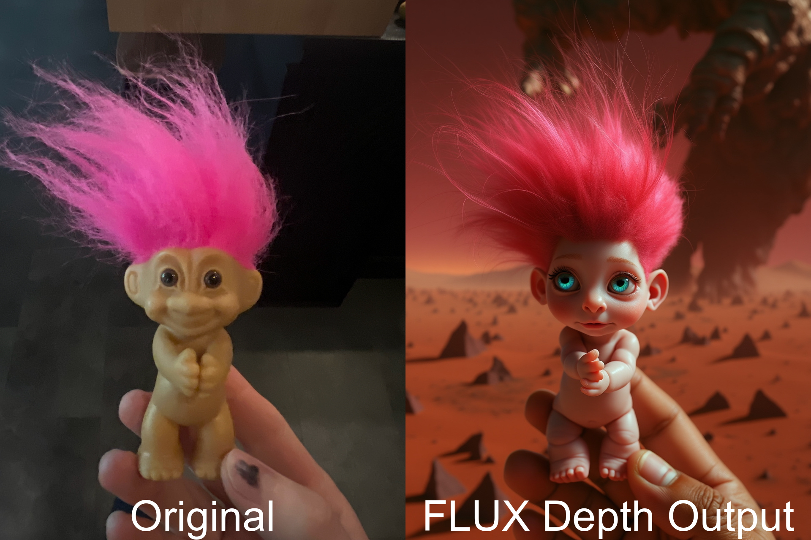

<!-- README.md is generated from README.Rmd. Please edit that file -->

```{r, include = FALSE}
knitr::opts_chunk$set(
  collapse = TRUE,
  comment = "#>",
  fig.path = "man/figures/README-",
  out.width = "100%"
)
```

# bfl

<!-- badges: start -->
[](https://lifecycle.r-lib.org/articles/stages.html#experimental)
<!-- badges: end -->

The goal of the bfl package is to simplify the creation of FLUX images using the Black Forest Labs
(BFL) API. The API provides access to endpoints for four distinct FLUX models and three FLUX tools,
enabling users to generate and manipulate high-quality images with ease. To learn more about the models, 
visit [Black Forest Labs FLUX Models](https://blackforestlabs.ai/flux-1-tools/).

## Installation

You can install the development version of bfl from [GitHub](https://github.com/gacolitti/bfl) with:

``` r
# install.packages("pak")
pak::pak("gacolitti/bfl")
```

## Authentication

To use the `bfl` package, you need an API key from [Black Forest Labs](https://api.bfl.ml/auth/login). 
To authenticate, define an
environment variable named `BFL_API_KEY` in your `.Renviron` file with your API key value. 

For example, add the following line to your `.Renviron` file:

```
BFL_API_KEY=your_api_key_here
```

## Examples

#### FLUX Dev
```{r generating-images, eval=FALSE}
library(bfl)
library(magick)

gen_flux_dev(
  prompt = "cypherpunk girl with red sunglasses, futuristic scene in the background",
  prompt_upsampling = TRUE,
  seed = 2
)
```

```{r, echo=FALSE}

```

#### FLUX Pro
```{r, eval=FALSE}
gen_flux_pro(
  prompt = "cypherpunk girl with red sunglasses, futuristic scene in the background",
  prompt_upsampling = TRUE,
  seed = 1
)
```

```{r, echo=FALSE}

```

#### FLUX Pro Ultra
```{r, eval=FALSE}
gen_flux_pro1.1_ultra(
  prompt = "cypherpunk girl with red sunglasses, futuristic scene in the background",
  prompt_upsampling = TRUE,
  seed = 1
)
```

```{r, echo=FALSE}

```


#### FLUX Fill Pro

```{r, eval=FALSE}
mask <- base64enc::base64encode(system.file("/images/backyard-original_mask.jpeg", package = "bfl"))
image <- base64enc::base64encode(system.file("/images/backyard-original.jpeg", package = "bfl"))
res <- bfl::gen_flux_fill_pro1(
  image = image,
  mask = mask,
  prompt = "alien spaceship, ultrarealistic, detailed",
  seed = 200,
  steps = 50,
  prompt_upsampling = FALSE,
  download_path = "inst/images/backyard-spaceship-fill-example.jpeg"
)

original_mask <- image_read(system.file("/images/backyard-original_mask.jpeg", package = "bfl"))
original <- image_read(system.file("/images/backyard-original.jpeg", package = "bfl"))
output <- image_read(res$result$sample)

images_edited <- purrr::imap(
  list(
    "Original" = original, 
    "Original Mask" = original_mask,
    "FLUX Fill Output" = output
  ),
  ~ image_annotate(
      .x,
      text = .y,
      size = 100,
      gravity = "south",
      color = "white"
    )
)

image_mosaic(image_append(do.call(c, images_edited)))
```

```{r, echo=FALSE}

```

#### FLUX Depth Pro

```{r, eval=FALSE}
control_image <- base64enc::base64encode(system.file("/images/low-res-pink-hair-figurine.jpeg", package = "bfl"))
res <- gen_flux_depth_pro1(
   control_image = control_image,
   prompt = paste0(
     "small humanoid creature with pink hair gently grasped by a human thumb and three fingers, ",
     "mars desert and sand dunes in the background, ultrarealistic, detailed"
   ),
   seed = 2,
   steps = 50,
   prompt_upsampling = TRUE
 )

original <- image_read(system.file("/images/low-res-pink-hair-figurine.jpeg", package = "bfl"))
output <- image_read(res$result$sample)

images_edited <- purrr::imap(
  list(
    "Original" = original, 
    "FLUX Depth Output" = output
  ),
  ~ image_annotate(
      .x,
      text = .y,
      size = 100,
      gravity = "south",
      color = "white"
    )
)

image_mosaic(image_append(do.call(c, images_edited)))
```

```{r, echo=FALSE}

```

